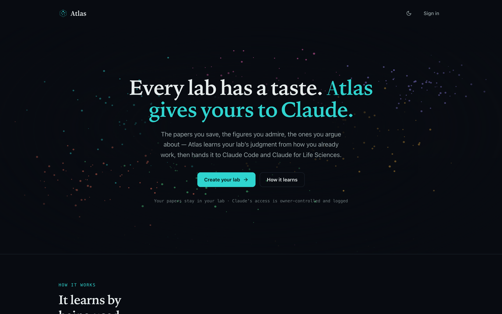
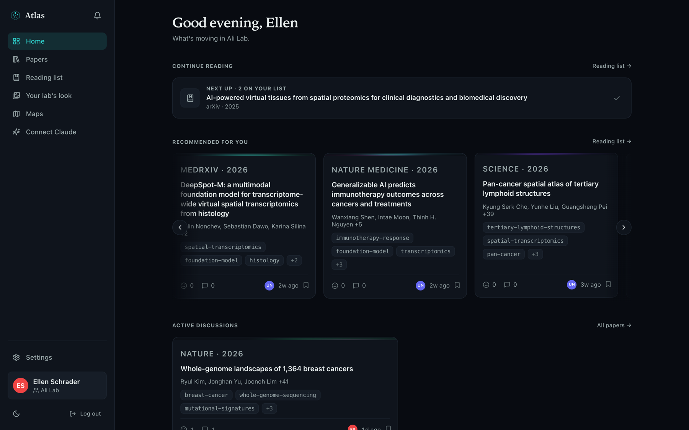
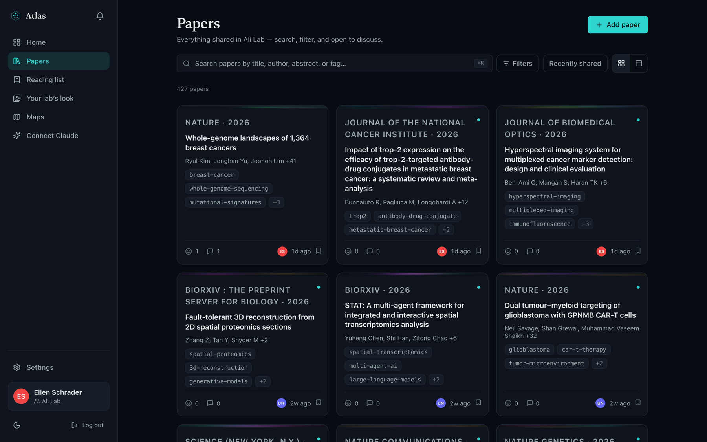
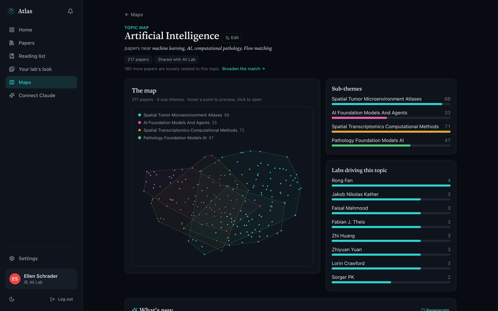
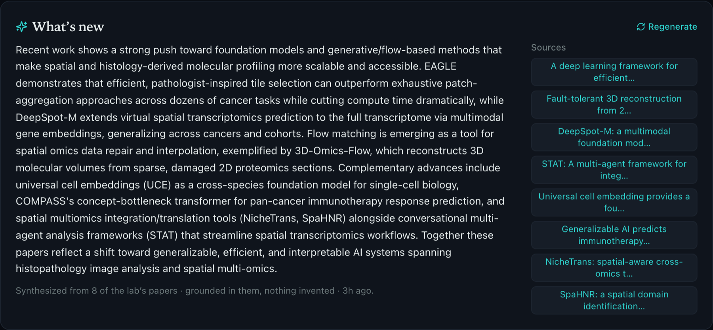
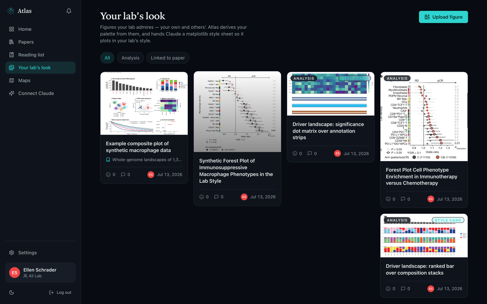
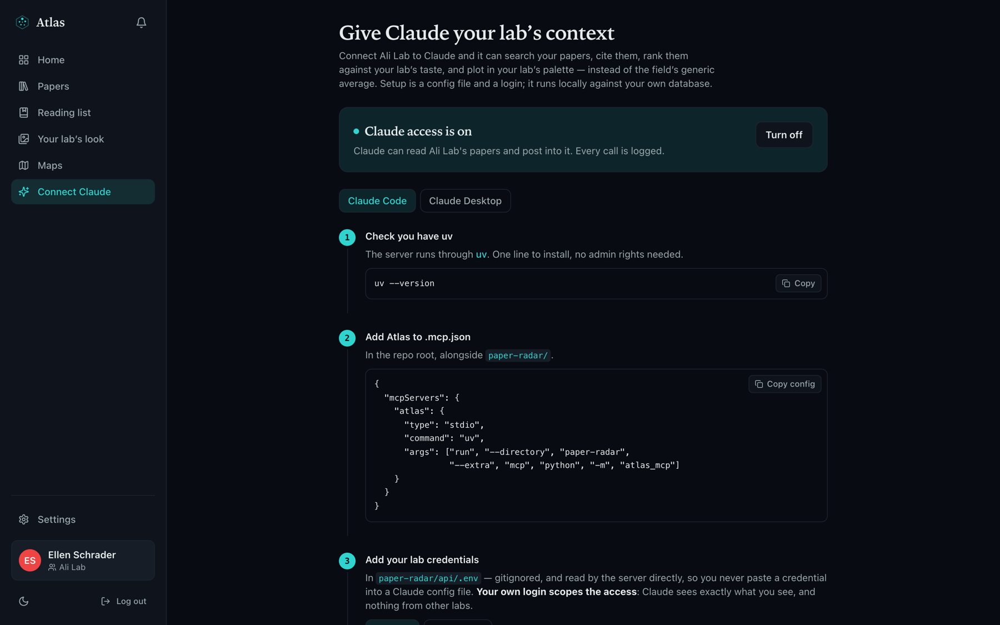

<div align="center">

# Atlas

**Every lab has a taste. Atlas gives yours to Claude.**

The papers you save, the figures you admire, the ones you argue about in group meeting —
Atlas learns your lab's judgment from how you already work, then hands it to Claude.

[**Live app**](https://atlas-papers.vercel.app) · [API](https://paper-radar-api.fly.dev/docs) · [MIT licensed](LICENSE)

</div>



---

## The problem

A lab's taste — what's worth reading, what's overhyped, what a good figure looks like —
lives in one senior postdoc's head. When they finish, it walks out the door. What's left
behind is a Dropbox folder and a dead Teams channel.

Atlas keeps it. It turns the papers a lab already shares into a corpus that is searchable,
mapped by meaning, and — crucially — **legible to an LLM**. Claude can then answer the
question a literature search can't: not "what exists?" but "what's new *to us*?"

## What it does

- **Shared corpus.** Papers posted by URL are deduped, resolved against arXiv / Crossref /
  PubMed / Europe PMC, enriched with summaries and tags, and made searchable by keyword or
  by meaning (Voyage embeddings + pgvector).
- **Learns from behaviour.** No profile to fill in. Saves, reactions, and comments are
  weighted differently — a save counts more than a 🤔 — and decay over time, so
  recommendations track where the lab is going, not where it's been.
- **Topic maps.** A map is a topic the lab watches, kept current: papers clustered by
  meaning, sub-themes named, and a written digest of what's new — every claim grounded in
  a paper the lab actually posted.
- **The lab's visual style.** A mood board of figures the lab admires. Atlas derives the
  palette and emits a real matplotlib style sheet.
- **Claude, connected.** An MCP server exposes all of the above as tools, scoped to your
  lab, owner-gated, and audit-logged.

## A tour

### Home — what's moving in the lab

Recommendations from your reading history, papers needing attention, and active discussions.



### Papers — keyword or semantic search

Everything the lab has shared, deduped and enriched. Toggle semantic search to find papers
by meaning rather than string match.



### Maps — a topic the lab watches

A scoped t-SNE layout with named sub-themes, the labs driving the topic, and the papers
that matter most within it.



Each map writes a digest of recent work. Every sentence is grounded in the lab's own
papers, and each source chip links back to the paper it came from.



### Your lab's look

Figures the lab admires — your own and others'. This is the second thing a lab owns that a
model can't guess: what your plots are supposed to look like.



---

## Connect Claude

Atlas ships an MCP server (`atlas_mcp`) that runs **locally, on your machine**, against
your own Atlas database. Claude sees exactly what your account sees — nothing from other
labs. The app has a `/connect` page that walks through this with your `team_id`
pre-filled:



### 1. An owner turns Claude access on

Access is a **lab-wide setting**, not one member's call. Until an owner enables it in
**Settings**, every MCP tool call for that lab is refused. Every call that does run is
written to an activity log the whole lab can see.

### 2. Check you have `uv`

The server runs through [uv](https://docs.astral.sh/uv/getting-started/installation/) — one
line to install, no admin rights needed.

```bash
uv --version
```

### 3. Register the server

**Claude Code** — `.mcp.json` in the repo root:

```json
{
  "mcpServers": {
    "atlas": {
      "type": "stdio",
      "command": "uv",
      "args": ["run", "--directory", "paper-radar",
               "--extra", "mcp", "python", "-m", "atlas_mcp"]
    }
  }
}
```

**Claude Desktop** — Settings → Developer → Edit Config, same JSON but with an
**absolute** path for `--directory` (Claude Desktop doesn't run from your repo).

### 4. Add your lab credentials

Credentials go in `paper-radar/api/.env` — gitignored, and read by the server directly, so
you never paste a secret into a Claude config file.

```bash
ATLAS_EMAIL=you@your-lab.org
ATLAS_PASSWORD=your-atlas-password
ATLAS_TEAM_ID=<your team's uuid>          # from the /connect page
ATLAS_WEB_URL=https://atlas-papers.vercel.app   # so cited links open your Atlas
```

On a shared or managed machine, use a Supabase access token instead of a password —
`ATLAS_TOKEN=...`, which the server prefers when set. It keeps your password off disk, but
it expires and the stdio server has no refresh token, so you'll re-paste it periodically.

### 5. Verify

Restart Claude, then run `/mcp` in Claude Code (or open the tools menu in Claude Desktop).
You should see **atlas** with its tools listed. Ask it something your lab actually works on:

```
> Use the atlas tools to search our lab for fibroblast papers,
  then list the 5 most recent posts.

⏺ atlas - search_lab_papers (query: "fibroblast")
  ⎿ Reciprocal regulation of fibroblast–macrophage equilibrium governs skin integrity
     Nature Immunology · 2026 · doi:10.1038/s41590-026-02434-5
     ILC2s regulate a fibroblast progenitor niche in the pancreas
     Science · 2026 · doi:10.1126/science.aea5113
     … 8 more

⏺ atlas - list_recent_papers (limit: 5)
  ⎿ Whole-genome landscapes of 1,364 breast cancers — Nature · 2026
     … 4 more
```

### What Claude can do, once connected

| Tool | What it does |
| --- | --- |
| `list_labs` | The labs your account belongs to |
| `search_lab_papers` | Keyword or semantic search over the lab's corpus |
| `list_recent_papers` | Most recently posted papers |
| `get_paper` | One paper's full metadata, abstract, and deep link |
| `similar_papers` | Papers near a given one in embedding space |
| `recommend_reading` | What to read next, from the lab's taste model |
| `lab_digest` | What happened in the lab over the last *n* days |
| `novelty_check` | Whether an idea is new **to this lab** |
| `draft_related_work` | A cited related-work paragraph from the lab's papers |
| `list_moodboard` / `moodboard_categories` | Browse the lab's figures |
| `get_figure_image` / `get_figure_palette` | Fetch a figure, or extract its palette as hex |
| `get_moodboard_style` | The lab's palette as a real matplotlib style sheet |
| `check_colorblind_safety` | Audit a palette for colourblind readers |
| `preview_plot_spec` | Validate and render a plot spec with synthetic data |
| ✏️ `post_paper` | Post a paper to the lab, optionally tagging a teammate |
| ✏️ `add_plot_to_moodboard` | Add a rendered figure to the lab's board |

✏️ writes to the shared lab — these preview first and only commit when you confirm in the
client.

### Security model

- **Owner-gated.** Claude access is off by default and only a lab owner can turn it on.
- **Scoped by your own login.** The server authenticates as *you*; Supabase row-level
  security does the rest. Claude cannot see another lab's papers, comments, or figures.
- **Read-only by default.** The two write tools require an explicit confirmation in the
  client before anything lands in the shared lab.
- **Audited.** Every tool call — including refused ones — is logged and visible to the
  whole lab on the `/connect` page.
- **Injection-resistant.** Paper text (abstracts, comments) is wrapped as untrusted data,
  so a hostile abstract can't hijack the agent.

---

## Architecture

```
                    ┌─────────────────────────┐
   Claude Code /    │  atlas_mcp  (stdio MCP) │  runs locally · your credentials
   Claude Desktop ──│  18 tools, owner-gated  │──┐
                    └─────────────────────────┘  │
                                                 ▼
   Browser ── React SPA (Vercel) ──────────► Supabase (Postgres + pgvector)
                    │                            ▲   auth · RLS · storage
                    │  Python-only work          │
                    └─► FastAPI (Fly.io) ────────┘
                          resolve · embed · cluster · summarise
                          Voyage (embeddings) · Claude (enrichment, digests)
```

- **`web/`** — React 18 + Vite + TypeScript + Tailwind, TanStack Query, Supabase JS. Talks
  to Supabase directly for CRUD; calls the API for Python-only work.
- **`api/`** — FastAPI. Resolves URLs to metadata (SSRF-guarded), embeds papers with
  Voyage, builds t-SNE map layouts, and writes grounded digests with Claude. Holds the
  service-role key; never exposed to the browser.
- **`atlas_mcp/`** — the MCP server. Reuses `api/.env` and hits Supabase as the signed-in
  user.
- **`supabase/`** — schema and RLS migrations. Papers are global; posts, comments,
  reactions, maps, and figures are team-scoped.

## Local development

**Prerequisites:** [uv](https://docs.astral.sh/uv/), Node 20+, and a Supabase project
(cloud or local via the Supabase CLI).

```bash
git clone https://github.com/ellen-schrader/papers.git
cd papers/paper-radar

# 1. Database — apply the schema
supabase db push          # or: supabase start, for a local stack

# 2. API
cp api/.env.example api/.env    # SUPABASE_URL, SUPABASE_ANON_KEY,
                                # SUPABASE_SERVICE_ROLE_KEY, VOYAGE_API_KEY
uv sync --extra api
uv run uvicorn api.app:app --reload        # http://127.0.0.1:8000 (docs at /docs)

# 3. Web
cd web
cp .env.example .env.local      # VITE_SUPABASE_URL, VITE_SUPABASE_ANON_KEY, VITE_API_URL
npm install && npm run dev      # http://localhost:5173
```

`ANTHROPIC_API_KEY` enables paper enrichment, cluster naming, and map digests. Without it
the app runs; those features stay empty. Without `VOYAGE_API_KEY`, semantic search, maps,
and recommendations fall back to keyword-only / cold-start behaviour.

The **service-role key is server-side only** — it bypasses RLS. It belongs in `api/.env`
and nowhere near `web/`.

### Checks

```bash
uv run pytest          # API, auth, maps, style cards
uv run ruff check
cd web && npm run typecheck
```

## Deployment

| Piece | Host | Notes |
| --- | --- | --- |
| Web | Vercel | SPA rewrites + a strict CSP (`web/vercel.json`) |
| API | Fly.io | `fly deploy --remote-only` (`fly.toml`); scales to zero, so the first request after idle cold-starts |
| Database | Supabase | Postgres + pgvector + auth + storage; RLS enforced |

## Privacy

Paper **metadata and abstracts** are sent to Voyage AI (embeddings) and Anthropic
(summaries, tags, cluster names, digests), plus public metadata APIs (arXiv, Crossref,
PubMed, Europe PMC) when resolving a paper. User identities and email addresses are **not**
sent to these services. Don't paste confidential or unpublished text you don't want leaving
your infrastructure.

## License

MIT — see [LICENSE](LICENSE).
